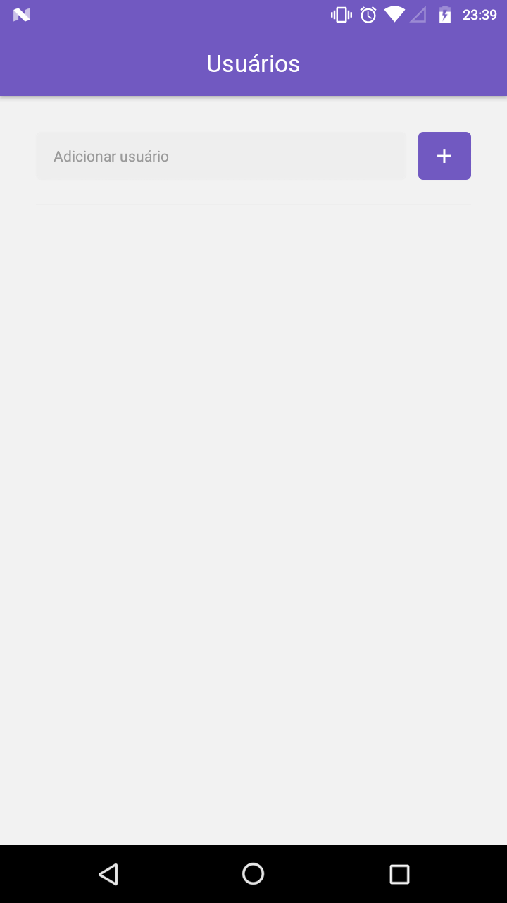
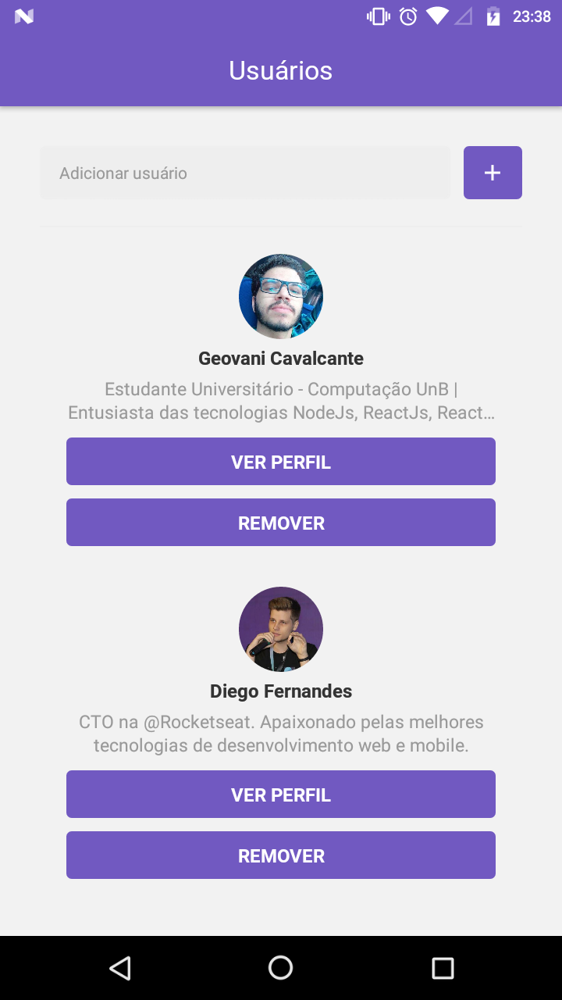
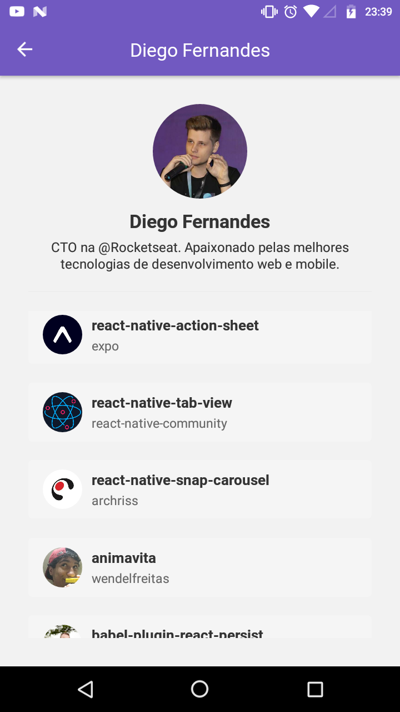
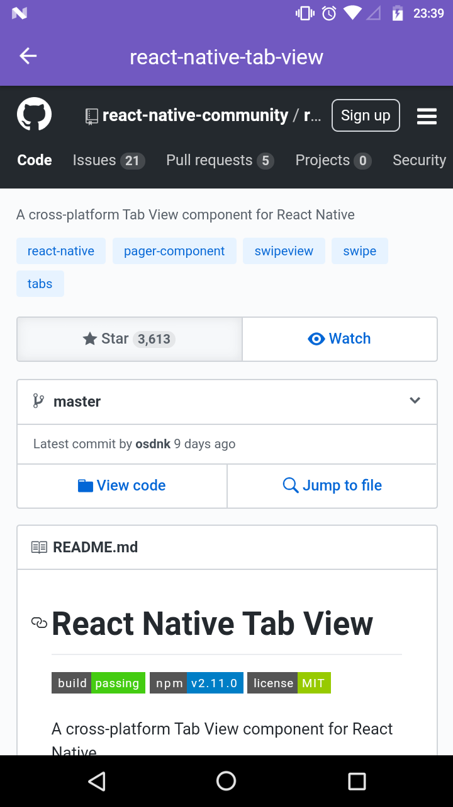

<h1 align="center">
    
</h1>

<h3>
  Desafio 6: Primeiro projeto com React Native
</h3>

Consumindo a api do github para buscar usuários e mostrar uma lista com seus repositórios.
Foi implementado algumas funcionalidades também como Scroll Infinito, Pull to Refresh e WebView.

<h1 align="center">
    
    
    
    
</h1>

## :rocket: Tecnologias

Esse projeto foi desenvolvido no Bootcamp GoStack da Rocketseat com as seguintes tecnologias:

-  Reac Native
-  Axios
-  Styled-Components 
-  WebView
-  React-navigation
-  Reactotron
-  React-native-vector-icons
-  VS Code com EditorConfig, Eslint e Prettier para padronização de código

## :information_source: Como executar este projeto

```bash
# Clone este repositório
$ git clone https://github.com/geovanicv/starred-repositories

# Navegue até a pasta
$ cd starred-repositories

# Instale as dependências
$ yarn

# Execute o app
$ react-native run-android

# obs: é necessário estar conectado ao usb do celular com a depuração USB e opções de desenvolvedor habilitadas.
```
